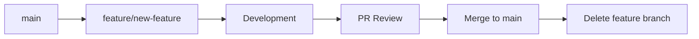

# 📖 The GitKraken Bible - Git Mastery for Modern Development

*Your comprehensive guide to Git workflows, best practices, and battle-tested strategies.*

## Table of Contents

1. [Core Principles](#core-principles)
2. [Branch Strategy](#branch-strategy)
3. [Commit Guidelines](#commit-guidelines)
4. [Pull Request Workflow](#pull-request-workflow)
5. [Merge Strategies](#merge-strategies)
6. [Conflict Resolution](#conflict-resolution)
7. [Advanced Techniques](#advanced-techniques)
8. [Common Scenarios](#common-scenarios)

## Core Principles

### The Golden Rules

1. **Commit Early, Commit Often** - Small, atomic commits are better than large monolithic ones
2. **Never Rewrite Public History** - Once pushed to a shared branch, avoid force pushes
3. **Branch Protection is Sacred** - Always protect `main` and `develop` branches
4. **Review Before Merge** - Every change deserves at least one pair of eyes
5. **Test Before Push** - Local validation prevents CI failures

### Repository Health Indicators

✅ **Healthy Repository:**
- Clear branch naming conventions
- Descriptive commit messages
- Regular merges to main
- Minimal long-lived branches
- Active code review participation

❌ **Unhealthy Repository:**
- Cryptic commit messages ("fix", "update", "wip")
- Stale branches (>30 days without activity)
- Direct commits to main
- Large merge conflicts
- Untested code in PRs

## Branch Strategy

### Branch Naming Convention

```
<type>/<description>
```

**Types:**
- `feature/` - New functionality
- `fix/` - Bug fixes
- `hotfix/` - Critical production fixes
- `chore/` - Maintenance tasks
- `docs/` - Documentation updates
- `refactor/` - Code restructuring
- `test/` - Test additions or fixes
- `codex/` - Automated fixes from AI tools

**Examples:**
```bash
feature/user-authentication
fix/login-redirect-error
hotfix/payment-gateway-timeout
chore/update-dependencies
docs/api-documentation
refactor/database-queries
test/add-e2e-tests
codex/sast-remediation-run-123
```

### Branch Lifecycle



**Steps:**
1. Create branch from `main`
2. Develop feature with atomic commits
3. Push to remote
4. Open Pull Request
5. Address review feedback
6. Merge when approved
7. Delete feature branch

### Protected Branches

**main:**
```yaml
protection_rules:
  - require_pull_request: true
  - require_reviews: 1
  - dismiss_stale_reviews: true
  - require_status_checks: true
  - require_branch_up_to_date: true
  - no_force_push: true
  - no_deletions: true
```

## Commit Guidelines

### Conventional Commits

Format:
```
<type>(<scope>): <subject>

<body>

<footer>
```

**Types:**
- `feat`: New feature (MINOR version bump)
- `fix`: Bug fix (PATCH version bump)
- `docs`: Documentation only
- `style`: Code formatting (no logic change)
- `refactor`: Code restructuring (no behavior change)
- `perf`: Performance improvement
- `test`: Adding or updating tests
- `build`: Build system changes
- `ci`: CI configuration changes
- `chore`: Maintenance tasks
- `revert`: Revert previous commit

**Scope:** The affected module/component (optional)

**Subject:** Imperative, present tense ("add" not "added")

**Examples:**

```bash
feat(auth): add OAuth2 authentication flow

Implemented OAuth2 with Google and GitHub providers.
Added user session management and token refresh logic.

Closes #123
```

```bash
fix(api): resolve race condition in webhook handler

The webhook handler was processing duplicate events due to
missing idempotency checks. Added event ID tracking to
prevent duplicate processing.

Fixes #456
```

```bash
chore(deps): update Next.js to v14.2.0

Updated Next.js and related dependencies.
Verified build and all tests pass.
```

### Atomic Commits

✅ **Good:**
```bash
git commit -m "feat(ui): add dark mode toggle button"
git commit -m "style(ui): update dark mode color scheme"
git commit -m "test(ui): add dark mode toggle tests"
```

❌ **Bad:**
```bash
git commit -m "add dark mode, fix bugs, update deps, refactor code"
```

## Pull Request Workflow

### PR Template

```markdown
## Description
Brief description of changes

## Type of Change
- [ ] Bug fix
- [ ] New feature
- [ ] Breaking change
- [ ] Documentation update

## Testing
- [ ] Unit tests added/updated
- [ ] Integration tests pass
- [ ] Manual testing completed

## Checklist
- [ ] Code follows style guidelines
- [ ] Self-review completed
- [ ] Comments added for complex logic
- [ ] Documentation updated
- [ ] No new warnings generated
- [ ] Tests pass locally

## Screenshots (if applicable)
[Add screenshots for UI changes]

## Related Issues
Closes #123
```

### Review Process

**For Author:**
1. Self-review your changes
2. Ensure all tests pass
3. Add descriptive PR title and description
4. Request specific reviewers if needed
5. Respond to feedback promptly
6. Keep PR scope focused

**For Reviewer:**
1. Review within 24 hours
2. Test changes locally when needed
3. Provide constructive feedback
4. Approve or request changes
5. Follow up on addressed comments

## Merge Strategies

### Squash and Merge (Recommended)

**When to use:** Most feature branches

**Benefits:**
- Clean, linear history
- Single commit per feature
- Easy to revert
- Reduces noise in git log

**Example:**
```bash
# Multiple commits in feature branch
feat(auth): add login form
feat(auth): add validation
fix(auth): handle edge cases
test(auth): add login tests

# Becomes single commit in main
feat(auth): implement user login with validation (#123)
```

### Rebase and Merge

**When to use:** Small, well-organized changes

**Benefits:**
- Linear history
- Preserves individual commits
- Clean integration

**Example:**
```bash
git checkout feature/my-feature
git rebase main
git push --force-with-lease
```

### Merge Commit

**When to use:** Large features, releases

**Benefits:**
- Preserves full branch history
- Clear feature boundaries
- Easy to see what was merged when

## Conflict Resolution

### Prevention

```bash
# Keep feature branch updated
git checkout feature/my-feature
git fetch origin
git rebase origin/main

# Or using merge
git merge origin/main
```

### Resolution Steps

1. **Identify conflicts:**
```bash
git status
# Shows files with conflicts
```

2. **Open conflicted files:**
```
<<<<<<< HEAD
Current branch code
=======
Incoming branch code
>>>>>>> feature/my-feature
```

3. **Resolve manually:**
- Keep your changes
- Keep their changes
- Combine both
- Write new solution

4. **Mark as resolved:**
```bash
git add <resolved-file>
git rebase --continue
# or
git merge --continue
```

5. **Verify:**
```bash
npm test
npm run build
```

## Advanced Techniques

### Interactive Rebase

```bash
# Rebase last 3 commits
git rebase -i HEAD~3

# Options:
# pick - keep commit
# reword - change commit message
# squash - combine with previous
# fixup - like squash, discard message
# drop - remove commit
```

### Cherry-pick

```bash
# Apply specific commit to current branch
git cherry-pick <commit-hash>
```

### Bisect (Find Bug Introduction)

```bash
git bisect start
git bisect bad                 # Current version is bad
git bisect good v1.0.0        # v1.0.0 was good
# Git checks out middle commit
npm test                       # Test it
git bisect good/bad           # Repeat until found
git bisect reset              # Clean up
```

### Stash Management

```bash
# Save work in progress
git stash push -m "WIP: feature description"

# List stashes
git stash list

# Apply stash
git stash apply stash@{0}

# Apply and remove
git stash pop

# Clear all stashes
git stash clear
```

## Common Scenarios

### Scenario 1: Accidentally Committed to Main

```bash
# Don't panic! Create branch from current state
git branch feature/my-work

# Reset main to origin
git reset --hard origin/main

# Switch to your new branch
git checkout feature/my-work
```

### Scenario 2: Need to Update PR After Review

```bash
# Make fixes
git add <files>
git commit -m "fix: address review feedback"
git push
```

### Scenario 3: Merge Conflict During PR

```bash
# Update from main
git fetch origin
git checkout feature/my-branch
git rebase origin/main

# Resolve conflicts
# ...

git push --force-with-lease
```

### Scenario 4: Need to Undo Last Commit

```bash
# Keep changes, undo commit
git reset --soft HEAD~1

# Discard changes and commit
git reset --hard HEAD~1

# Undo commit, keep files staged
git reset --mixed HEAD~1
```

### Scenario 5: Wrong Branch

```bash
# Move uncommitted changes to correct branch
git stash
git checkout correct-branch
git stash pop
```

## Best Practices Summary

### DO ✅

- Write descriptive commit messages
- Create small, focused PRs
- Test before pushing
- Keep branches up to date
- Delete merged branches
- Use protected branches
- Review your own PRs first
- Respond to reviews promptly

### DON'T ❌

- Force push to shared branches
- Commit secrets or credentials
- Create massive PRs (>500 lines)
- Let branches go stale
- Merge without review
- Ignore failing tests
- Use generic commit messages
- Work directly on main

---

**Remember:** Good Git hygiene leads to:
- Easier debugging
- Clearer history
- Faster reviews
- Fewer conflicts
- Happier team

*Master these practices and you'll become a Git legend!* 🏆
